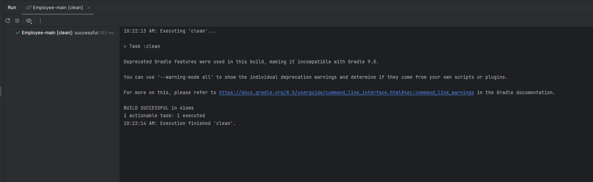
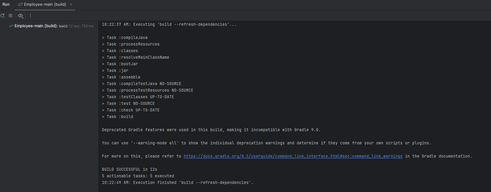
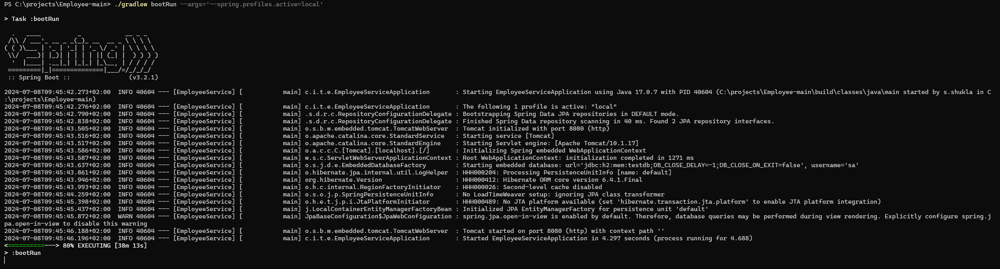

### Clean Build and Deploy Instructions:
- To Clean: `./gradlew clean` 
- To Refresh Dependencies and Build: `./gradlew --refresh-dependencies build`  
- To Deploy and select local profile: `./gradlew bootRun --args='--spring.profiles.active=local'` 

### Verify:
- Install Java 17 (Verify using, `java -version` [Java 17])
- Install Gradle (Verify using, `gradle -version` [Gradle 8.5])

### To Setup DB Instructions: (In-Memory DB):
- On a Unix-like system (Linux, macOS), you can set environment variables as below:
  - export DATASOURCE_URL=your_database_url
  - export DATASOURCE_USERNAME=your_database_username
  - export DATASOURCE_PASSWORD=your_database_password
- On Windows, you can set environment variables as below:
  - set DATASOURCE_URL=your_database_url
  - set DATASOURCE_USERNAME=your_database_username
  - set DATASOURCE_PASSWORD=your_database_password
- e.g.
  - `set DATASOURCE_URL=jdbc:h2:mem:testdb`
  - `set DATASOURCE_USERNAME=sa`
  - `set DATASOURCE_PASSWORD=password`

### Information:
- Defined 2 profiles(local, prod). local will run with h2 database, prod profile will run with whatever db we provide, it will use.
- Swagger definition is added for documentation, so once application is started swagger documentation is available in `http://localhost:8080/swagger-ui/index.html`.

